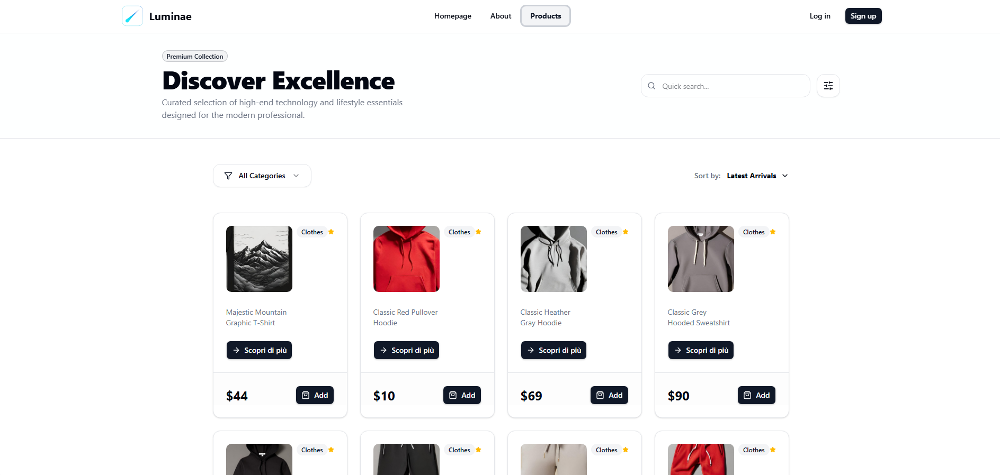
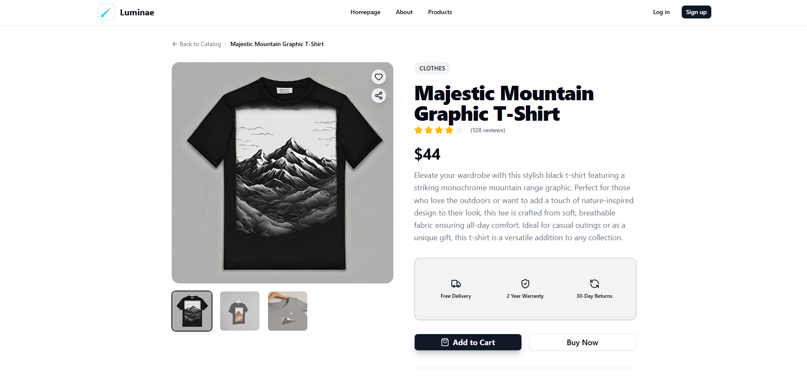
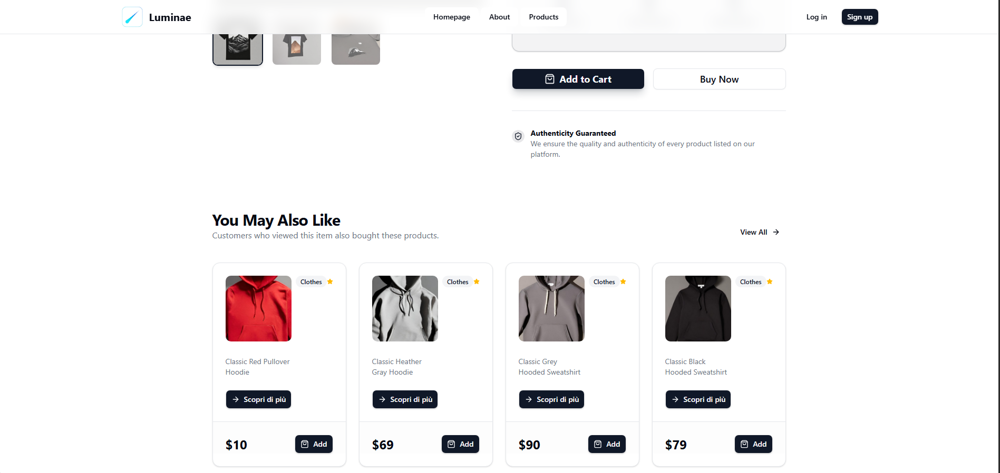

# Luminae Store

**Luminae** is a premium e-commerce experience built with the latest web technologies, focusing on speed, accessibility, and a stunning user interface.

> **⚠️ Disclaimer**: This project is a realistic simulation created for **educational and demonstrative purposes only**. It serves as a portfolio showcase of modern web development skills. It is **not** a real commercial platform, and no actual transaction or products are involved.

## Tech Stack

*   **Framework**: React (Vite)
*   **Language**: TypeScript
*   **Styling**: Tailwind CSS, Shadcn UI
*   **State Management**: React Query (TanStack Query)
*   **Routing**: React Router DOM (v6+)

## Key Features

*   **Fast & Responsive**: Optimized for all devices.
*   **Modern UI**: Glassmorphism effects, smooth transitions, and a clean aesthetic.
*   **Infinite Scrolling**: Seamless product browsing with `useSuspenseInfiniteQuery`.
*   **Dynamic Filtering**: Server-side category filtering for efficient data handling.
*   **Suspense Integration**: React 18 Suspense for elegant loading states.

## Showcase

### 🛍️ Product Listing & Filtering
*Browse our catalog with server-side category filters and a responsive grid layout.*


### 🔍 Product Details
*Immersive product details with high-quality imagery and comprehensive specifications.*


### 🔗 Related Products
*Smart recommendations to help users discover similar items they'll love.*


## Getting Started

1.  **Clone the repository**:
    ```bash
    git clone https://github.com/yourusername/luminae-store.git
    cd luminae-store
    ```

2.  **Install dependencies**:
    ```bash
    npm install
    ```

3.  **Run the development server**:
    ```bash
    npm run dev
    ```

## Contributing

Contributions are welcome! Please feel free to submit a Pull Request.

---

*Designed and developed for the modern web.*
